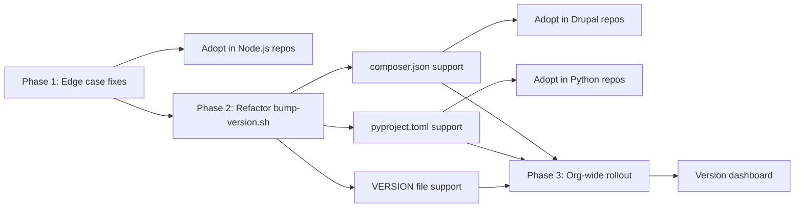

# Auto Version Action — Technical Roadmap

**Last updated:** 2026-02-27
**Owner:** Lucas Pretti
**Status:** Draft

## Diagnosis

Every repository at EPO handles versioning differently — some manually, some with ad-hoc scripts — leading to wasted time, inconsistent releases, and human errors (wrong tags, missing changelogs, forgotten bumps). The core challenge is not just automating one repo, but providing a **single, universal versioning solution** that works across all EPO ecosystems (Node.js, PHP/Drupal, Python, Helm) without per-repo customization.

## Guiding Policies

- **One action for all repos** — every EPO project uses the same `auto-version-action`, no forks or copies
- **Convention over configuration** — sensible defaults, minimal required inputs
- **Ecosystem-agnostic version bumping** — replace `npm version` dependency with generic file manipulation
- **Non-breaking rollout** — existing Node.js repos keep working as new ecosystems are added

## Standard Kit

| Category | Tool | Notes |
|----------|------|-------|
| Action type | Composite (bash) | No compilation, lightweight |
| Version strategy | Conventional Commits | `feat:`, `fix:`, `feat!:` |
| Branch model | staging → master (or master-only) | Configurable via inputs |
| CI platform | GitHub Actions on GHES | `git.epo.org`, runners: `web-default` |
| Release API | GitHub REST API | Tags + releases with changelogs |

## Roadmap

### Phase 1: Stabilize & Harden (Now — 0-4 weeks)

**Theme:** Make the current Node.js support production-ready and adopted in existing JS repos.

| Item | Priority | Effort | Depends on | Owner |
|------|----------|--------|------------|-------|
| Fix edge cases from real-world usage (see `docs/edge-cases-and-findings.md`) | P0 | 1w | - | TBD |
| Add error handling for missing tools (`jq`, `node`, `git`) | P0 | 2d | - | TBD |
| Validate `fetch-depth: 0` and fail fast with clear message | P1 | 1d | - | TBD |
| Adopt in 2-3 existing Node.js/Next.js repos at EPO | P0 | 1w | Edge case fixes | TBD |
| Document single-branch (master-only) vs two-branch workflow | P1 | 1d | - | TBD |

**Exit criteria:** Running in production on 3+ Node.js repos with no manual version interventions.

### Phase 2: Multi-Ecosystem Support (Next — 4-10 weeks)

**Theme:** Replace `npm version` with generic version bumping to support PHP, Python, and arbitrary version files.

| Item | Priority | Effort | Depends on | Owner |
|------|----------|--------|------------|-------|
| Refactor `bump-version.sh` to use `sed`/`jq` instead of `npm version` | P0 | 1w | Phase 1 | TBD |
| Support `composer.json` (Drupal/PHP) | P0 | 3d | Refactor bump | TBD |
| Support `pyproject.toml` (Python) | P1 | 3d | Refactor bump | TBD |
| Support plain `VERSION` file (generic) | P2 | 1d | Refactor bump | TBD |
| Add `version-file-type` input (auto-detect or explicit) | P1 | 2d | All format support | TBD |
| Adopt in Drupal and mixed repos at EPO | P0 | 1w | composer.json support | TBD |

**Exit criteria:** At least one non-Node.js repo (Drupal) using the action in production.

### Phase 3: Scale & Polish (Later — 10-24 weeks)

**Theme:** Org-wide adoption, advanced features, and operational confidence.

| Item | Priority | Effort | Depends on | Owner |
|------|----------|--------|------------|-------|
| Monorepo support (multiple version files per repo) | P1 | 2w | Phase 2 | TBD |
| Kubernetes deployment manifest version update | P2 | 1w | Phase 2 | TBD |
| Dry-run mode (calculate version without creating releases) | P2 | 3d | - | TBD |
| Configurable changelog format/template | P2 | 1w | - | TBD |
| Org-wide rollout to all remaining EPO repos | P1 | 2w | Phase 2 | TBD |
| Dashboard/summary of versions across all repos | P3 | 2w | Org-wide rollout | TBD |

**Exit criteria:** All EPO repos using auto-version-action; no manual versioning anywhere.

## Dependencies

## Risks

| Risk | Likelihood | Impact | Mitigation |
|------|-----------|--------|------------|
| GHES action version sync issues | Medium | High | Pin action versions, test on GHES before rollout |
| Self-hosted runner missing tools (`jq`, `node`) | Medium | Medium | Add tool checks at action start, fail with clear instructions |
| Conventional Commits not adopted by all devs | High | Medium | Default to `patch` for non-conventional commits; add team guidelines |
| Edge cases in version escalation logic | Medium | High | Track in `edge-cases-and-findings.md`, fix as discovered |
| `sed` behaves differently on macOS vs Linux runners | Low | Medium | Only runs on Linux runners (GHES); test both if needed |

## Tech Debt Register

| Item | Quadrant | Priority | Phase |
|------|----------|----------|-------|
| `npm version` dependency for all ecosystems | Prudent-Deliberate | P0 | 2 |
| `git add -A` in bump commit (too broad) | Reckless-Inadvertent | P1 | 1 |
| No input validation or pre-flight checks | Prudent-Deliberate | P0 | 1 |
| `action.yml` version-file description says "any file" but only `package.json` works | Prudent-Deliberate | P1 | 2 |
