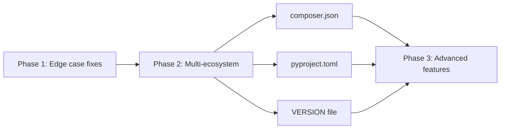

# Auto Version Action -- Technical Roadmap

**Last updated:** 2026-02-27
**Owner:** Lucas Pretti
**Status:** Draft

## Diagnosis

Many repositories handle versioning differently, some manually, some with ad-hoc scripts, leading to wasted time, inconsistent releases, and human errors (wrong tags, missing changelogs, forgotten bumps). The goal is a **single, universal versioning action** that works across ecosystems (Node.js, PHP, Python, Helm) without per-repo customization.

## Guiding Policies

- **One action for all repos** -- no forks or copies needed
- **Convention over configuration** -- sensible defaults, minimal required inputs
- **Ecosystem-agnostic version bumping** -- generic file manipulation instead of tool-specific commands
- **Non-breaking rollout** -- existing repos keep working as new ecosystems are added

## Standard Kit

| Category | Tool | Notes |
|----------|------|-------|
| Action type | Composite (bash) | No compilation, lightweight |
| Version strategy | Conventional Commits | `feat:`, `fix:`, `feat!:` |
| Branch model | staging -> production (or production-only) | Configurable via inputs |
| Release API | GitHub REST API | Tags + releases with changelogs |

## Roadmap

### Phase 1: Stabilize & Harden (Done)

| Item | Status |
|------|--------|
| Fix edge cases from real-world usage | Done |
| Add error handling for missing tools (`jq`, `git`) | Done |
| Validate `fetch-depth: 0` and fail fast with clear message | Done |
| Document single-branch vs two-branch workflow | Done |

### Phase 2: Multi-Ecosystem Support (Done)

| Item | Status |
|------|--------|
| Refactor `bump-version.sh` to use `sed`/`jq` instead of `npm version` | Done |
| Support `composer.json` (PHP/Drupal) | Done |
| Support `pyproject.toml` (Python) | Done |
| Support plain `VERSION` file (generic) | Done |
| Auto-detect version file format by filename | Done |

### Phase 3: Scale & Polish (Planned)

| Item | Priority | Effort |
|------|----------|--------|
| Monorepo support (multiple version files per repo) | P1 | 2w |
| Kubernetes deployment manifest version update | P2 | 1w |
| Dry-run mode (calculate version without creating releases) | P2 | 3d |
| Configurable changelog format/template | P2 | 1w |

## Dependencies

## Risks

| Risk | Likelihood | Impact | Mitigation |
|------|-----------|--------|------------|
| Conventional Commits not adopted by all devs | High | Medium | Default to `patch` for non-conventional commits |
| Edge cases in version escalation logic | Medium | High | Track in `edge-cases-and-findings.md`, fix as discovered |
| `sed` behaves differently on macOS vs Linux | Low | Medium | Only runs on Linux runners; test both if needed |
